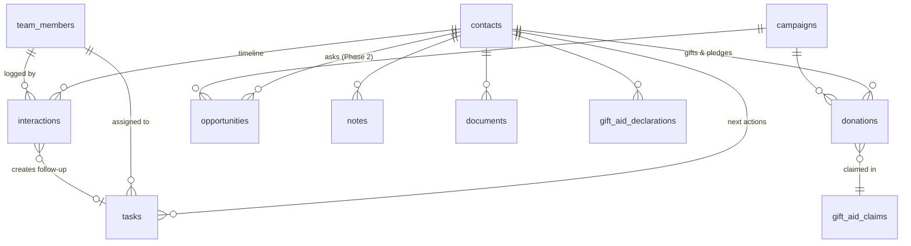

# Yeshiva Donor & Fundraising CRM — Research, Scope & Build Plan

*Prepared August 2026 · Status: proposal for review · Companion file: [`schema.sql`](./schema.sql) (draft data model)*

This document responds to the full requirements brief ("Donor & Fundraising CRM — Requirements & Workflow", §1–35). It covers: an honest build-vs-buy check, the recommended architecture, the data model, how the daily "the CRM remembers for me" engine works, the automation rules, a detailed AI integration plan, integration research (WhatsApp, email, calendar, Drive), UK-specific additions (Gift Aid), security & GDPR, and a phased build plan with effort estimates and acceptance tests.

---

## 1. Executive summary

- **Recommendation: build it**, on the stack already running the yeshiva's siddur app in production (Supabase + PWA on Vercel), as a **separate project and repository**. The brief describes a relationship-and-action engine, not a donations database — that daily workflow (keep-in-touch scheduling, one-next-action-per-relationship, 20-second mobile logging) is exactly what off-the-shelf donor CRMs are weakest at, and it is the whole point of the brief.
- **One deliberate departure from the brief's phasing:** the brief puts AI in Phase 3, but **one AI feature belongs in Phase 1 — AI Quick Capture** (speak or type one sentence after a call; Claude turns it into a structured interaction + next action + follow-up date). Data entry friction is the number-one reason CRMs die (§24, §30, §33). Everything else about the brief's phasing is kept.
- **One recommended addition the brief doesn't mention: Gift Aid.** For a UK charity, tracked declarations plus an HMRC claim export adds 25% to eligible donations — it will likely pay for the entire system many times over.
- **Costs:** running costs start near £0 and settle around **£25–£50/month** (Supabase Pro + hosting + Claude API). The big cost is build effort: roughly **9–12 weeks part-time** to the end of Phase 2 for one developer working with AI pair-programming, with a genuinely usable core in ~5–6 weeks.
- **The four success tests in §34 are used as the formal acceptance criteria for Phase 1** (see §12 below).

---

## 2. Build vs. buy — the honest check

Before committing to a build, the off-the-shelf UK options were reviewed. Summary of the current market:

| Option | Cost | Fit |
|---|---|---|
| [Donorfy](https://www.plinth.org.uk/complete-guide/donorfy-alternatives) | Free up to 500 constituents; paid from ~£39/mo | Solid UK donor CRM with Gift Aid. Weak on the brief's core: no keep-in-touch frequency engine, no "one next action per relationship" discipline, basic reporting. |
| [Beacon](https://compareyourbusinesscosts.co.uk/beacon-crm) | From ~£33.50/mo (annual), 2,000 contacts, 3 users | Closest UK fit; modern, has Gift Aid. Still form-heavy for daily logging; contact-frequency nurturing is manual; per-contact pricing grows. |
| [CiviCRM](https://mountev.co.uk/civicrm/best-crm-for-uk-charities-in-2026-civicrm-vs-beacon-vs-salesforce-vs-donorfy/) | Free (open source); you pay hosting/config | Powerful but famously heavy to configure and dated UX — fails the "simple to the person using it" principle (§30). |
| Salesforce Nonprofit (10 free licences) | Free licences; expensive admin | Massive overkill; needs ongoing admin expertise. |

**Why build anyway:**

1. The differentiating requirements — configurable contact frequency with automatic overdue flagging (§12), days-since-meaningful-contact everywhere (§13), an action dashboard rather than a database view (§19), and the 20–30 second mobile update (§24) — are precisely where every product above is weakest. Those aren't features to bolt on; they're the architecture.
2. No per-constituent or per-user pricing as the donor base and team grow.
3. AI-native from the start (quick capture, pre-meeting briefs, drafting) — no commercial donor CRM does this well today, and none does it with awareness of the Jewish calendar ("call him after Sukkos" should resolve to a real date).
4. The developer already operates this exact stack in production (vecker.app: Supabase, PWA, Vercel, Capacitor), so there is no new-platform risk.

**Fallback worth naming:** if build capacity disappears, Donorfy's free tier (<500 constituents) is the sensible stopgap. Worth knowing it exists; not worth designing around.

---

## 3. Recommended architecture

```
┌─────────────── PWA (installable, offline-tolerant) ───────────────┐
│  React + TypeScript + Vite · Tailwind + shadcn/ui                 │
│  Dashboard · Contact profile · Quick Capture · Lists · Reports    │
└──────────────────────────────┬─────────────────────────────────────┘
                               │ supabase-js (RLS-enforced)
┌──────────────────────────────▼─────────────────────────────────────┐
│  Supabase (dedicated project, London region eu-west-2)            │
│  · Postgres 17 — all entities, views for derived stats            │
│  · Auth — email magic link + Google, roles via team_members       │
│  · Row Level Security — role & privacy enforcement in the DB      │
│  · Storage — documents (proposals, receipts, photos)              │
│  · Edge Functions — AI endpoints, ICS feed, HMRC export           │
│  · pg_cron — nightly automation run                               │
└──────────────────────────────┬─────────────────────────────────────┘
                               │ server-side only (API key never in client)
                  ┌────────────▼────────────┐
                  │  Claude API (Anthropic) │  quick capture · briefs · drafts
                  └─────────────────────────┘
```

**Key decisions and why:**

- **Separate Supabase project, not the siddur one.** Donor PII, giving history and private relationship notes must not share a database (or its keys and RLS surface) with a public consumer app. Region **eu-west-2 (London)** keeps personal data in the UK. Same reasoning: **new repository** (e.g. `yeshiva-crm`), not this one.
- **React rather than the siddur app's vanilla JS.** A CRM is form-, table- and filter-heavy; component reuse and typed data access will pay for themselves within weeks. Vite + shadcn/ui keeps it light and fast to build.
- **PWA first, native later if ever.** Installable on the home screen, with a **manifest shortcut straight to Quick Capture** (the same pattern the siddur app already uses for shortcuts). No app-store friction, instant updates. Nothing here needs Shabbos-proof native notifications the way the siddur app did; push can come later via web push.
- **All logic that must be trustworthy lives in Postgres** — RLS for permissions, views for derived numbers, triggers for the audit trail, pg_cron for scheduled automation. The client stays thin; a future native app or a second front end inherits everything.
- **Claude API is called only from Edge Functions.** The Anthropic key is a server secret; the client never talks to the AI directly.

---

## 4. Data model

Full draft DDL is in [`schema.sql`](./schema.sql). The shape (brief §27 asks for separate, connected areas — this delivers exactly that):



**Entities** (→ brief section they satisfy):

| Table | Purpose | Brief |
|---|---|---|
| `contacts` | One central profile: identity, comms, address, relationship fields, classification, capacity, keep-in-touch frequency | §3, §4, §6, §7, §12, §14 |
| `interactions` | Every call/WhatsApp/email/meeting/event — the timeline. Meeting-specific fields (location, attendees, ask amount) are nullable columns on the same table | §9, §17 |
| `donations` | Every gift as its own record; a **pledge is a donation with `status = 'pledged'`**, payments link back to it | §8, §11 |
| `opportunities` | Active asks with amount, probability, expected decision date — the pipeline (Phase 2) | §7 |
| `tasks` | All follow-ups and next actions, with origin tracking (manual / automation / AI) | §10, §16 |
| `campaigns` | Campaigns and projects fundraised for | §27 |
| `notes` | Dated, authored, categorised notes; `is_private` flag for restricted notes | §15 |
| `documents` | Links (Drive) or uploads (Supabase Storage) per contact | §18 |
| `gift_aid_declarations`, `gift_aid_claims` | UK Gift Aid (recommended addition, see §9 below) | — |
| `lookup_options` | **One config table for every dropdown** — stages, priorities, tiers, interaction types, next-action types — so lists are configurable, not hard-coded | §5, §25 |
| `automation_rules` | Every automation's on/off switch and timing parameters | §22 |
| `team_members`, `audit_log` | Users, roles, and a trigger-maintained change history | §25, §26 |

**Design decisions worth flagging:**

1. **Meetings are interactions, not a separate table.** The brief lists Meetings as its own area (§27), but a separate table would split the timeline and duplicate data (§33 forbids exactly that). Instead, `interactions` carries the §17 meeting fields, and a **scheduled** meeting is an interaction with `status='scheduled'` and a future date. "Meetings this week" is a filter, the timeline stays single, and completing a meeting is an edit, not a copy.
2. **Derived numbers are views, never stored columns.** Lifetime giving, giving this/last year, largest/average gift, last contact, **days since meaningful contact**, keep-in-touch due date, LYBUNT ("gave last year but not this year") — all computed in one `contact_stats` view. They can never drift out of date, and "overdue" self-corrects at midnight without a batch job flipping flags.
3. **"Meaningful contact" is defined in data, not code.** Each interaction type in `lookup_options` carries a `meaningful` flag (a meeting is; an automated receipt email isn't), and any individual interaction can override it. The keep-in-touch clock (§12) and days-since-contact (§13) count only meaningful ones.
4. **Duplicate merge is a first-class operation** (§25): normalised phone/email matching on entry warns before creating a duplicate; a merge tool re-parents all child records and leaves a `merged_into` tombstone so old links keep working.
5. **Multi-currency-safe from day one:** every donation stores `amount + currency + amount_gbp`, so rollups are always consistent even if 99% of gifts are GBP.

---

## 5. The daily engine — how "the CRM remembers for me" actually works

This is the heart of the brief (§1, §11–§13, §19, §29). It is deliberately **boring, deterministic SQL** — no AI, nothing to trust on faith.

**The Action Dashboard is a set of live queries** (nothing is precomputed, nothing can be stale):

| Dashboard section (§19) | Source |
|---|---|
| Today — calls, messages, follow-ups, tasks due | `tasks` where `due_on = today` and open, grouped by action type |
| Meetings today / this week | `interactions` where `status='scheduled'` |
| Overdue follow-ups & tasks | open `tasks` where `due_on < today` — *computed*, not a flipped flag |
| Donors overdue for relationship contact | `contact_stats` where `kit_due_on < today` (last meaningful contact + frequency) |
| Outstanding pledges | `donations` where `status='pledged'`, net of linked payments |
| Neglected important donors | `contact_stats` joined to configurable thresholds (High priority 30+ days, VIP 90+ days — thresholds live in `automation_rules`, §13) |
| Pipeline value / weighted value (Phase 2) | `opportunities` sum and probability-weighted sum |
| Relationship counts by stage | `contacts` grouped by `stage` |

**The one-next-action invariant (§10):** every contact in an *active* stage should have either an open task or a keep-in-touch frequency. The nightly run doesn't silently fix violations — it surfaces them as a dashboard line ("3 active relationships have no next action"), because a human should decide what the next action is. Saving an interaction always prompts for the next action (prefilled by AI — see §7), which is how the invariant is maintained in practice with zero extra clicks.

**Keep-in-touch (§12):** `contacts.contact_frequency_days` (14/30/60/90/180/365/custom, or none) + last meaningful interaction date → `kit_due_on` in the view. The nightly run creates a single "Keep in touch" task when it falls due and none is already open — so it appears in Today like any other task, and completing it (by logging an interaction) resets the clock automatically.

**The after-a-call flow (§24, §29, §30):** open Quick Capture → speak or type one line → confirm the AI-prefilled form (type, summary, outcome, next action, follow-up date) → Save. One insert updates everything downstream — timeline, last contact, days-since, dashboard — because everything downstream is a view. Target: under 30 seconds, two taps plus dictation.

---

## 6. Automations (deterministic)

All of §22, implemented as either **database triggers** (instant) or the **nightly pg_cron run** (scheduled), with every timing/threshold read from `automation_rules` so it's configurable without code changes:

| Rule | Mechanism | Default |
|---|---|---|
| Donation received → Thank You task (+ Receipt task) | trigger on `donations` | immediate; skip if one already open |
| Pledge recorded but unpaid → chase reminders | nightly | at 14 and 30 days, then monthly |
| Proposal sent, no response recorded → follow-up task | nightly | 7 days |
| Keep-in-touch period elapsed → KIT task | nightly | per-contact frequency |
| High-priority / VIP donor with no meaningful contact → neglect flag | nightly | High: 30d · Active: 60d · VIP: 90d |
| Follow-up date passed → shows as Overdue | none needed — computed in queries | live |
| Meeting tomorrow → reminder | nightly (+ web push later) | 1 day before |

Two principles: **automations create tasks and flags, never send external messages** (a human always sends; see AI guardrails below), and **anything that can be computed is computed rather than stored** so state can't drift.

---

## 7. AI integration plan

The requested focus area. Governing principle: **AI where language is involved; SQL where arithmetic is involved.** "Who have I neglected?" is a query, not a prompt. AI earns its place at the two points where language is the actual bottleneck: getting information *in* (logging) and getting understanding *out* (briefing).

All AI calls run in Supabase Edge Functions against the **Claude API** (`claude-opus-5` by default — current pricing $5/M input, $25/M output tokens; simple high-volume parses can drop to `claude-haiku-4-5` at $1/$5 if cost ever matters, which at this scale it won't).

### 7.1 AI Quick Capture — Phase 1, the flagship

The single highest-leverage feature in the whole system, because it attacks the reason CRMs fail (§24, §30, §33: "a complicated system that nobody wants to update").

> **Input** (spoken via the phone keyboard's dictation, or typed):
> *"met dovid cohen in london this morning, very warm, strong interest in the building project, discussed twenty k, he wants me to call him after sukkos"*
>
> **Output** (Claude, via structured outputs — guaranteed-valid JSON, never free text):
> ```json
> {
>   "contact_query": "dovid cohen",
>   "interaction": { "kind": "meeting", "occurred_at": "2026-08-23T10:00",
>     "location": "London", "summary": "Met in London. Very warm.",
>     "outcome": "Strong interest in the building project; discussed £20,000.",
>     "ask_amount": 20000 },
>   "next_action": { "type": "call", "due_on": "2026-10-05",
>     "note": "Call after Sukkos re building project / £20k" },
>   "suggested_updates": { "interests_add": ["Building Project"] }
> }
> ```
>
> The app resolves `contact_query` against the contacts table (fuzzy match, with a picker if ambiguous), shows the prefilled form, the user taps **Save**. The original dictation is kept on the record (`ai_raw_input`) so nothing is ever lost to a bad parse.

- **Jewish-calendar-aware dates:** "after Sukkos", "after the chagim", "before Pesach" resolve to real dates via the Hebcal API — the same service the siddur app already uses. Donors genuinely talk like this; no commercial CRM handles it.
- Handles multilingual input (a summary dictated in Yiddish or Hebrew comes back as a clean English summary, or is kept as-is — configurable).
- Failure mode is graceful: if the parse is wrong, the user is looking at an editable form, not a saved record.

### 7.2 Pre-meeting brief & donor summary — Phase 2

A **"Brief me"** button on the profile and on any scheduled meeting (§32 asks for exactly this). An Edge Function assembles the donor's stats, timeline, interests and open items into a prompt; Claude returns a five-bullet brief:

> *Who he is and how you know him · relationship trajectory · giving pattern and capacity signal · what happened last time and what was promised · suggested talking points and the one thing not to forget.*

Cached on the profile and regenerated only when new interactions land, so it costs pennies and loads instantly. This directly targets **success test 2** ("understand the entire relationship within 60 seconds") for the cases where the at-a-glance header isn't enough.

### 7.3 Drafting assistance — Phase 2/3

Generate **drafts** — never send — for thank-you messages (informed by the gift, the project, the relationship history and the donor's preferred language), proposal follow-ups, and project updates. Output lands in a copy-to-WhatsApp/email box. Tone learns from examples the user provides once in settings.

### 7.4 Weekly relationship digest — Phase 2

Monday morning email: the numbers come from SQL (due/overdue/neglected/pipeline); Claude writes the two-paragraph narrative on top ("Three relationships need rescuing this week; the Reuven proposal is 12 days quiet…"). Deterministic data, readable delivery.

### 7.5 Natural-language lists — Phase 3

"London donors interested in the building project I haven't spoken to in 60 days" → Claude translates to the existing filter schema (not raw SQL — it can only express filters the UI already has, so it can't do anything a user couldn't click). Saved as a Smart List (§20).

### 7.6 Email ingest — Phase 3

A private dropbox address (e.g. `log@crm.yeshiva.org`). Forward or BCC a donor email; an Edge Function matches the sender/recipient to a contact and files an AI-summarised interaction. This is the 80/20 of "email integration" (§23) at 5% of the cost of full Gmail sync.

### 7.7 Guardrails (non-negotiable)

1. **AI never sends anything externally.** Drafts and suggestions only; a human always presses send.
2. **AI never writes to the database unreviewed.** Quick Capture prefills a form; the user saves it. Every AI-touched record carries `source = 'quick_capture_ai'` etc.
3. **All numbers shown to the user come from SQL**, never from a model's arithmetic.
4. **PII handling:** API calls go server-side only; Anthropic's API does not train on customer data by default; note the processor relationship in the privacy notice (see §10).

### 7.8 AI running costs

Realistic volume (≈40 quick captures/day, ≈100 briefs+drafts/month, one weekly digest) is roughly 2–3M input + 0.4M output tokens/month → **≈ £12–£25/month on `claude-opus-5`, or ~£3–5 on Haiku for the parsing share**. Negligible next to the value; no need to economise on model quality.

---

## 8. Integration research (email, calendar, WhatsApp, Drive)

The brief's own caveat (§23) is correct and is the plan: *the core CRM must not depend on any of these.* Findings and the recommended sequence, cheapest-first:

### WhatsApp — the honest picture

| Tier | What | Cost / risk | Phase |
|---|---|---|---|
| **1. Click-to-chat + Quick Capture** | Every profile gets a WhatsApp button (`wa.me/<number>`) opening the chat; after messaging, Quick Capture logs it in seconds | Free, zero compliance risk | **Phase 1** |
| **2. WhatsApp Business Platform (Cloud API)** via Meta or a BSP (e.g. Twilio) | Genuine two-way logging: inbound donor messages land in the CRM automatically; templated outbound (event invites, receipts) | Meta business verification; per-message fees from Oct 2026 — [UK ≈ £0.038/marketing message](https://sleekflow.io/en-us/blog/whatsapp-business-price), utility far cheaper, [1,000 free service conversations/month](https://www.engagelab.com/blog/whatsapp-business-api-pricing); 24-hour service-window rules; BSP markup [~$0.003–0.01/msg](https://www.uptail.ai/blog/whatsapp-business-api-pricing-2026-what-it-costs-and-how-billing-works) | Phase 3, **decision point** — only if Tier 1 proves insufficient |
| **3. Scraping WhatsApp Web / unofficial bridges** | — | **Ruled out.** Violates WhatsApp ToS; realistic risk of banning the fundraiser's personal number — an existential risk to donor relationships | Never |

Tier 1 + AI Quick Capture covers ~90% of the actual need ("what did we say, what happens next") because the *summary and next action* are what matter, not the message transcript.

### Google Calendar

- **Phase 2 quick win:** a read-only **ICS feed** Edge Function — subscribe once in Google Calendar and every CRM meeting appears on the phone's calendar. A day's work, no OAuth.
- **Phase 3:** full Google Calendar API two-way sync (OAuth per user) if creating meetings from Calendar is wanted.

### Email

- **Phase 2/3:** the forward/BCC dropbox (§7.6). Full Gmail API sync is deliberately deferred — it's the highest-effort, highest-permission integration and the dropbox captures most of the value.

### Google Drive

- **Phase 1:** `documents` supports links, so a donor's Drive folder URL sits on the profile from day one (§18). Plus native uploads to Supabase Storage for one-off files.
- **Phase 3:** Drive picker/API integration only if link-pasting proves annoying.

---

## 9. Recommended addition: Gift Aid (UK)

Not in the brief, but for a UK-registered charity this is the highest-ROI feature after the core: **+25% on every eligible donation from a UK taxpayer**.

- `gift_aid_declarations`: per-donor declarations (written/oral/online, date, whether it covers past and future gifts, cancellation) — [declarations and records must be retained ~6 years](https://www.lexisnexis.com/en-gb/legal/guidance/charitable-gift-aid-donations).
- Donations auto-flag as Gift Aid-eligible when a valid declaration covers them; a claims screen batches unclaimed eligible donations and **exports the HMRC Charities Online CSV** (fixed columns: Title, First name, Last name, House name/number, Postcode, Donation date, Amount — [per the buyer's guide](https://crmcharity.co.uk/gift-aid-software-complete-buyers-guide-uk-charities/)).
- The schema fields (house number, postcode) are captured on the contact anyway — the marginal build cost is small (~3–4 days in Phase 2).
- Assumption to confirm: the yeshiva is a registered charity/CASC enrolled with HMRC Charities Online. GASDS (small cash donations) can follow later.

---

## 10. Security, permissions & UK GDPR

**Roles (§26), enforced in the database (RLS), not just the UI:**

| Capability | Admin | Fundraiser | Viewer |
|---|---|---|---|
| View contacts & timelines | ✓ | ✓ | ✓ |
| Edit contacts / log interactions | ✓ | ✓ | — |
| View donation amounts | ✓ | ✓ | configurable, default — |
| View private notes | ✓ | author + admin | — |
| Export data | ✓ | — | — |
| Delete / merge records | ✓ | — | — |
| Settings, lookups, automation rules, users | ✓ | — | — |

- **Private notes** (`notes.is_private`) are enforced by an RLS policy — a restricted note is invisible at the API level, not hidden by the front end.
- **Audit trail** (§25): a trigger writes old/new values on every change to contacts, donations, tasks and notes into `audit_log`.
- **Auth:** Supabase Auth (magic link + Google), MFA available for admins; sessions revocable.
- **UK GDPR:** this system holds personal, financial and relationship data, so treat it properly from day one — data stored in London region; a short privacy notice + record of processing; lawful basis (legitimate interest for donor relationship management is the standard position for charities, with a documented assessment); **erasure = anonymisation** (strip personal data, retain the financial records HMRC requires for 6 years); the §14 principle ("only store what is appropriate and genuinely useful") stated in the team's usage guidance; processors listed (Supabase, Vercel, Anthropic — none train on the data).
- **Backups:** Supabase daily backups on Pro (£25/mo when adopted; recommended once real data lands), plus a weekly `pg_dump` to the yeshiva's own storage.

---

## 11. Phased build plan & estimates

Estimates assume one experienced developer, part-time, working with AI pair-programming (Claude Code). Calendar time will flex; the sequencing won't.

### Phase 0 — Foundations (~1 week)

Repo, CI, Supabase project (eu-west-2), auth + `team_members` + roles, RLS baseline, `lookup_options` seeded with the §5/§6/§9/§10 lists, `automation_rules` seeded with §22 defaults, app shell + navigation, deploy pipeline. **Finalise the schema** (review `schema.sql` together first — cheapest moment to change anything).

### Phase 1 — Core CRM (~4–6 weeks) → *usable every day*

Matches the brief's Phase 1 list (§35) exactly, plus Quick Capture:

1. Contacts: profile CRUD, **at-a-glance header** (§28), relationship fields, photo, archive
2. Interactions: timeline (§9), scheduled meetings, meeting fields
3. **AI Quick Capture** (voice/text → prefilled form) + manual quick-log fallback
4. Donations: record, pledge/received, per-donor stats (via `contact_stats`)
5. Tasks & next actions; stage & priority management
6. Keep-in-touch frequency engine + nightly automation run (KIT, thank-you, pledge-chase, proposal-follow-up, neglect flags)
7. **Action Dashboard** (§19: Today / Overdue / Relationships)
8. Global search (name, phone, email, company, city — Postgres FTS + trigram)
9. Smart lists: the §20 core set (follow-ups today, overdue, no-contact 30/60/90, LYBUNT, high-priority prospects…)
10. CSV import with duplicate detection (there is presumably an existing spreadsheet — importing it is part of Phase 1, not an afterthought)
11. PWA install + Quick Capture home-screen shortcut

**Exit criteria: the four §34 success tests, verified with real data** (see §12).

### Phase 2 — Fundraising management (~3–4 weeks)

- Opportunities/asks + pipeline (total & weighted value, §7, §19)
- Campaigns & projects; donations by campaign/project
- **Gift Aid**: declarations, eligibility, HMRC CSV export
- Reporting (§31): donations by month/year/project/campaign, retention, new/repeat/lapsed donors, average gift, pipeline by stage, fundraiser activity, prospect→donor conversion
- Pre-meeting briefs + donor summaries (AI); weekly digest email
- ICS calendar feed; documents polish (upload + Drive links)

### Phase 3 — Integrations & expansion (ongoing, per decision points)

- Email dropbox ingest → later, full email logging if warranted
- Google Calendar two-way sync
- **WhatsApp Business Platform decision point** (§8 above)
- Drafting assistance rollout; NL smart lists; duplicate-merge assistant
- Bulk communications, receipt PDF generation, event management — only if asked for

### Running costs summary

| Item | Start | At scale |
|---|---|---|
| Supabase | £0 (free tier) | £25/mo (Pro, for backups/PITR) |
| Hosting (Vercel/Cloudflare Pages) | £0 | £0–16/mo |
| Claude API | ~£5/mo | ~£25/mo |
| WhatsApp Cloud API (only if Phase 3 adopts it) | — | usage-based, ~£0.04/marketing msg, 1,000 free service convos/mo |
| **Total** | **~£5/mo** | **~£50–65/mo** |

---

## 12. Acceptance tests (the brief's §34, made executable)

1. **Daily management:** open the dashboard on a Monday morning seeded with realistic data → every due call/message/meeting/task, every overdue item, and every neglected relationship is on screen without any search or memory. *Pass = zero reliance on memory.*
2. **Donor knowledge:** open a donor untouched for six months → the at-a-glance header (§28) + timeline + AI brief convey who/how/history/interests/last conversation/current objective in under 60 seconds. *Timed with a stopwatch.*
3. **Nothing gets lost:** log "call him again in three months" via Quick Capture → confirm the task exists dated +3 months → advance the clock (test harness) → it surfaces in Today on the right morning.
4. **Relationship maintenance:** give a donor a 2-month frequency, log a meaningful contact, fast-forward past the window with no contact → KIT task auto-created and the donor appears under "overdue for relationship contact".

These four run as automated tests against seeded data before Phase 1 is declared done.

---

## 13. Open questions for the yeshiva

1. Roughly how many donors/prospects now, and expected in 2–3 years? (Shapes nothing architecturally, but sets import and UI-density priorities.)
2. How many team members will use it, in which roles?
3. Is there an existing spreadsheet/system to import? (Send a copy early — the importer is Phase 1.)
4. Is the yeshiva registered for HMRC Charities Online (Gift Aid)? Are declarations currently collected?
5. Which currencies actually occur besides GBP (USD? ILS? EUR?)
6. Who is the data controller contact for the privacy notice, and is there an existing privacy policy to extend?
7. Preferred domain for the CRM (affects the email-dropbox address later)?

---

## Sources

- WhatsApp Business API pricing & rules: [SleekFlow 2026/2027 pricing model](https://sleekflow.io/en-us/blog/whatsapp-business-price) · [EngageLab 2026 cost guide](https://www.engagelab.com/blog/whatsapp-business-api-pricing) · [Uptail per-message billing](https://www.uptail.ai/blog/whatsapp-business-api-pricing-2026-what-it-costs-and-how-billing-works) · [Blueticks conversation categories](https://blueticks.co/blog/whatsapp-business-api-pricing-2026)
- Gift Aid: [CRM Charity — Gift Aid software buyer's guide (2026)](https://crmcharity.co.uk/gift-aid-software-complete-buyers-guide-uk-charities/) · [LexisNexis — HMRC Gift Aid & GASDS guidance](https://www.lexisnexis.com/en-gb/legal/guidance/charitable-gift-aid-donations) · [Charity Excellence — HMRC Gift Aid rules](https://www.charityexcellence.co.uk/hmrc-gift-aid-rules/)
- UK charity CRM market: [Plinth — CRM for charities guide](https://www.plinth.org.uk/complete-guide/crm-for-charities) · [Plinth — Donorfy alternatives](https://www.plinth.org.uk/complete-guide/donorfy-alternatives) · [CompareYourBusinessCosts — Beacon review](https://compareyourbusinesscosts.co.uk/beacon-crm) · [MountEv — CiviCRM vs Beacon vs Salesforce vs Donorfy](https://mountev.co.uk/civicrm/best-crm-for-uk-charities-in-2026-civicrm-vs-beacon-vs-salesforce-vs-donorfy/) · [ESRE Media — charity CRM costs UK](https://esremedia.co.uk/blog/charity-crm-costs-uk)
