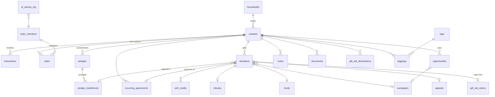

# 02 — Data Model & Dictionary

*Supersedes `../schema.sql` (v1). The matching DDL is [`../schema-v2.sql`](../schema-v2.sql). Every field a screen shows or an automation reads is defined here; if a later doc names a field not present here, that doc is wrong.*

## 1. Entity map & delta summary



**Deltas vs schema v1** (each justified in §2):

| # | Change | Borrowed from |
|---|---|---|
| D1 | `households` table; `contacts.household_id`; household rollups & greetings | NPSP / Neon / LGL |
| D2 | `soft_credits` with typed roles; parallel rollups, never double-counted | NPSP |
| D3 | `funds` + `appeals` tables; gifts coded on three axes (fund/campaign/appeal) | LGL |
| D4 | Pledges normalised out of `donations` into `pledges` + `pledge_installments`; payments applied to installments; write-offs | NPSP / Neon |
| D5 | `tributes` (in honor / in memory / yahrzeit) with acknowledgee loop | Neon |
| D6 | Computed `engagement_score` (tiered, with decay) and computed `donor_status`; manual `engagement_level` **deleted** | Bloomerang / Virtuous |
| D7 | Gift Aid: declaration wording version, oral-confirmation tracking, per-gift GA status, GASDS flag | Beacon / Donorfy |
| D8 | Task states gain `waiting` (with reason) and dateless ordered `queued`; tasks require a contact | OnePageCRM / folk |
| D9 | One pinned note per contact | HubSpot |
| D10 | `opportunities` gain ask-date, high/low projections, `stage_entered_at`, `last_moved_forward_at` | LGL / MarketSmart |
| D11 | Arrays (`interests`, `communities`, `classifications`, `preferred_causes`) **replaced** by `tags`/`taggings` with categories + nightly auto-tags | Donorfy |
| D12 | `recurring_agreements` (standing orders) with missed-payment detection — absent in v1 | Virtuous / Neon |
| D13 | `ai_activity_log` recording accept/edit/reject on every AI output | Einstein NBA / Breeze |
| D14 | `saved_views` (named smart views with layout/filter/sort) | Close / Attio |

## 2. Why the deltas

- **D1/D2 (households, soft credits).** Yeshiva giving is family giving: "Rabbi & Mrs. Goldstein" must be one relationship with one combined history and one correct salutation — while the ledger keeps exactly one legal donor per gift. Hard credit goes to the giving contact; household members receive automatic soft credits; introducers receive manual `influencer` soft credits. Rollups exist in *parallel columns* (hard vs. soft) so finance reports never double-count. ▸ **Borrowed:** NPSP household + soft-credit model — adapted: no separate "account" object; a household is a thin grouping.
- **D3 (three axes).** "What did the dinner raise?" (appeal), "how is the building campaign doing?" (campaign) and "what landed in the scholarship fund?" (fund) are different questions about the same gift. One `purpose` text field can't answer them. ▸ **Borrowed:** LGL's Fund/Campaign/Appeal taxonomy — adopted.
- **D4 (pledges).** "Pledged £5,000, paying £1,000 five times" needs promised-vs-received, balance due, overdue installments and write-offs as first-class states — v1's `status='pledged'` row couldn't express a schedule. ▸ **Borrowed:** NPSP/Neon pledge+payments — adapted: installments generated as rows, payments are ordinary donations linked to an installment.
- **D6 (two axes of truth).** Invariant I-7: the fundraiser's judgement (stage) and the system's arithmetic (status, engagement) never share a field.
- **D11 (tags).** Arrays can't carry metadata (since-when, source, suppression) and can't self-maintain. Tag categories + nightly auto-tags give self-maintaining segments ("RFM: At-Risk", "Gave to Dinner 2026") with one mechanism. ▸ **Borrowed:** Donorfy tags & auto-tags — adopted.
- **D12 (recurring).** A failed standing order is a silent relationship-ending event; v1 had nowhere to notice it. ▸ **Borrowed:** Virtuous missed-payment lapse trigger + Neon incomplete-transactions widget.

## 3. Entity dictionary

Conventions: **bold** = required. `lookup:x` = values from `lookup_options` list *x* (see §6). All tables get `id uuid pk default gen_random_uuid()`, `created_at`, and (where edited) `updated_at`, `created_by → team_members`; not repeated below. Editability: A=admin, F=fundraiser, V=viewer(read).

### 3.1 `contacts`

| Field | Type | Notes |
|---|---|---|
| `title` | text | Mr/Mrs/Rabbi/Dr/Dayan… lookup:title. Used in greetings and the HMRC claim CSV |
| **`first_name`**, `last_name` | text | Person; for orgs `last_name` empty and `organization` set |
| `hebrew_name` | text | For aliyah cards, yahrzeit context, personal touches |
| `organization`, `position`, `industry` | text | |
| `contact_kind` | text | lookup:contact_kind — individual · business · foundation · trust |
| `is_organisation_self` | bool | Exactly one seeded row = the yeshiva itself; anchors org-level tasks (I-2) |
| `photo_url` | text | |
| `household_id` | fk households | D1 |
| `email`, `phone`, `whatsapp` | text | phone/whatsapp stored E.164; whatsapp defaults to phone in UI |
| `preferred_language` | text | lookup:language — en · he · yi · fr … drives drafting (09 §4) |
| `preferred_channel` | text | lookup:action_type |
| `best_time_to_contact` | text | |
| `assistant_name`, `assistant_contact` | text | |
| `linkedin_url`, `website_url` | text | |
| `address_line1/2`, `city`, `postcode`, `country` | text | country default United Kingdom |
| `ga_house_no` | text | Optional override when address_line1 can't be parsed for the HMRC "house name or number" column |
| `source` | text | Where the contact came from |
| `introduced_by_id` | fk contacts | Drives the influencer soft-credit prompt (05 §1) |
| `introduced_by_note` | text | Introducers who aren't contacts |
| `relationship_owner_id` | fk team_members | Portfolio owner (06 §2) |
| `relationship_strength` | int 1–10 | Manual judgement — distinct from computed engagement (I-7) |
| `known_since` | date | |
| `mutual_connections` | text | |
| `birthday` | date | |
| `spouse_name`, `family_notes` | text | Spouse usually a linked household member; free text for the rest |
| `things_to_remember` | text | Surfaces in profile header area and pre-call brief |
| **`stage`** | text | lookup:stage — manual, default `prospect` |
| **`priority`** | text | lookup:priority — high · medium · low, default medium |
| `tier` | text | lookup:tier — A/B/C/D |
| `estimated_capacity` | numeric | Manual, from personal knowledge only — no covert wealth screening (11 §3) |
| `contact_frequency_days` | int | KIT cadence; set from presets (04 §5.6); null = none |
| `kit_paused_until` | date | Snooze without losing the cadence |
| `engagement_score` | int | **Computed nightly** (§4.3); read-only |
| `engagement_tier` | text | Computed: unknown · cold · cool · warm · hot · on_fire |
| `pinned_note_id` | fk notes | D9 — the "read this first" note |
| `is_archived`, `merged_into_id` | | Merge tombstone (06 §5) |

Gone from v1: `interests`, `communities`, `preferred_causes`, `classifications` arrays (→ tags, D11); `engagement_level` (→ computed, D6); `general_notes` (→ a note row, brief §15).

### 3.2 `interactions`

| Field | Type | Notes |
|---|---|---|
| **`contact_id`** | fk | |
| **`occurred_at`** | timestamptz | Future + `status='scheduled'` = an upcoming meeting |
| **`kind`** | text | lookup:interaction_kind (each kind carries `meaningful` + engagement `weight` metadata) |
| **`status`** | text | logged · scheduled · cancelled |
| `team_member_id` | fk | Who had the interaction |
| **`summary`** | text | The only field Quick Capture insists on beyond the contact (I-5) |
| `outcome` | text | |
| `is_meaningful` | bool | Default from kind metadata; per-record override |
| `location`, `attendees`, `purpose`, `ask_amount` | | Meeting fields (brief §17) |
| `source` | text | manual · quick_capture_ai · email_ingest · import |
| `ai_raw_input` | text | Original dictation kept verbatim (Granola provenance, 09 §2) |
| `ai_activity_id` | fk ai_activity_log | Links to the capture run |

### 3.3 `tasks`

| Field | Type | Notes |
|---|---|---|
| **`contact_id`** | fk | Required (I-2); org-level work attaches to the organisation-self contact |
| `opportunity_id` | fk | Optional: a "next move" on an ask (06 §2) |
| **`title`** | text | |
| `action_type` | text | lookup:action_type — call · whatsapp · email · meet · proposal · thank_you · receipt · kit · other |
| `details` | text | |
| `assigned_to` | fk team_members | |
| `due_on` | date | Required unless `status='queued'` |
| `priority` | text | lookup:priority |
| **`status`** | text | todo · in_progress · **waiting** · **queued** · done · cancelled (D8) |
| `waiting_for` | text | Whose court the ball is in ("sent GA form, awaiting return") — shown as the blue flag |
| `queue_order` | int | Order within a contact's queued stack; when the active next action completes, the first queued task activates (04 §3) |
| `completed_at` | timestamptz | |
| `origin` | text | manual · quick_capture_ai · auto:kit · auto:thank_you · auto:receipt · auto:pledge_chase · auto:proposal_follow_up · auto:meeting_reminder · auto:signal · journey:\<key\> |

### 3.4 `donations` — money actually received

| Field | Type | Notes |
|---|---|---|
| **`contact_id`** | fk | The one legal/hard-credit donor |
| **`donated_on`** | date | |
| **`amount`**, **`currency`**, **`amount_gbp`** | | GBP conversion at entry |
| **`fund_id`** | fk funds | D3 — accounting destination |
| `campaign_id` | fk campaigns | Initiative |
| `appeal_id` | fk appeals | The solicitation that produced it |
| `payment_method` | text | lookup:payment_method |
| `status` | text | received · refunded · cancelled (pledged rows are gone — D4) |
| `pledge_id`, `installment_id` | fk | Payment applied against a pledge/installment |
| `recurring_agreement_id` | fk | Payment under a standing order |
| `receipt_status` | text | not_sent · queued · sent · not_required — state machine (05 §3) |
| `receipt_pref` | text | Per-gift override of donor/system default: email · letter · both · none ▸ DonorPerfect |
| `thank_you_status` | text | not_done · task_open · done |
| `gift_aid_status` | text | ineligible · pending_declaration · eligible · claimed — recomputed on declaration/claim changes (05 §5) |
| `gift_aid_claim_id` | fk gift_aid_claims | Set when claimed |
| `is_gasds` | bool | Small cash/contactless ≤£30, no declaration needed ▸ Beacon |
| `notes` | text | |

### 3.5 `pledges` + `pledge_installments` (D4)

`pledges`: **contact_id**, **total_amount/currency/amount_gbp**, `fund_id`, `campaign_id`, `appeal_id`, **pledged_on**, `status` (open · fulfilled · written_off · cancelled), `write_off_amount`, `notes`.
`pledge_installments`: **pledge_id**, **due_on**, **amount**, `status` (expected · paid · partly_paid · overdue* · written_off). *overdue is computed in views, stored value stays `expected`.
Balance due = total − payments applied − write-off (view `pledge_balances`, §4).

### 3.6 `recurring_agreements` (D12)

**contact_id**, **amount/currency**, **frequency** (weekly · monthly · quarterly · annual), `payment_method`, `fund_id`, `starts_on`, `ends_on`, `expected_day`, `status` (active · paused · cancelled · **failing**), `last_payment_on`, `missed_count`. Nightly job flags `failing` when an expected payment is >7 days late (08 §5) — a missed standing order is a retention emergency ▸ Virtuous/Neon.

### 3.7 Gift Aid: `gift_aid_declarations` + `gift_aid_claims` (D7)

`gift_aid_declarations`: **contact_id**, **declared_on**, **method** (written · oral · online), `wording_version` (which locked HMRC wording the donor saw ▸ Beacon), `covers_past` (up to 4 back-years), `covers_future` (enduring), `covers_from` date, `oral_confirmation_sent_on` (HMRC requires a written confirmation of oral declarations), `cancelled_on`, `evidence_url`.
`gift_aid_claims`: `status` (draft-rolling · ready · submitted · paid), `submitted_on`, `hmrc_reference`, `total_donations`, `total_claimed`, `gasds_total`. Exactly one rolling `draft-rolling` claim exists at a time; eligible gifts attach to it automatically ▸ Beacon (05 §5).

### 3.8 `funds`, `campaigns`, `appeals` (D3)

`funds`: **name**, `code`, `is_restricted`, `is_active`. Seed: General · Scholarships · Building · Kollel.
`campaigns`: **name**, `goal_amount`, `starts_on`, `ends_on`, `description`, `is_active`.
`appeals`: **name**, `campaign_id?`, `year`, `channel` (dinner · letter · email · phone · event · other), `is_active`.

### 3.9 `opportunities` — asks (D10) `[P2]`

v1 fields plus: `ask_date`, `projection_high`, `projection_low` (▸ LGL Goals), `stage_entered_at` (auto on stage change), `last_moved_forward_at` (auto on *forward* stage change — feeds the stale-prospects list ▸ MarketSmart). `stage` seeds from moves management (§6). Every open opportunity should have an open task (`tasks.opportunity_id`) — surfaced, not enforced (I-3).

### 3.10 `team_members` + organisation

As v1 (`role`: admin · fundraiser · viewer) plus: `digest_hour` (morning digest send time, default 07:30), `digest_channel` (email · none), `drafting_examples` (text — tone samples for AI drafting, 09 §4), `can_see_amounts` (viewer-role refinement, 11 §2).

### 3.11 `notes`

As v1 (**contact_id**, `category` lookup:note_category, **body**, `is_private`, author) plus `is_pinned` — partial unique index: max one pinned note per contact (D9).

### 3.12 `documents`

As v1: **contact_id**, **title**, `kind` lookup:document_kind, `url` (Drive/external) or `storage_path` (Supabase Storage upload), check: one of the two present.

### 3.13 `households` (D1)

| Field | Notes |
|---|---|
| `name` | Auto-generated from members ("Goldstein Family"), editable override |
| `formal_greeting` | Auto: "Rabbi & Mrs. Goldstein"; override |
| `informal_greeting` | Auto: "Yossi & Rivky"; override |
| `hebrew_greeting` | Optional: "הרב ומרת גולדשטיין" — for Hebrew letters |
| `primary_contact_id` | Default addressee |

Auto-naming recomputes when members change unless overridden ▸ NPSP.

### 3.14 `soft_credits` (D2)

**donation_id**, **contact_id**, **role** (household · influencer · solicitor · matched_by · other), `amount` (default = full gift). Household soft credits auto-created/maintained by trigger; influencer credits prompted at gift entry when the donor has an `introduced_by_id` (05 §1). Rollups keep hard and soft totals in separate columns — soft never adds to financial totals ▸ NPSP.

### 3.15 `tributes` (D5)

**donation_id**, **tribute_type** (in_honor · in_memory · yahrzeit · simcha), **honoree_name**, `honoree_contact_id?`, `acknowledgee_name`, `acknowledgee_address`, `acknowledgee_contact_id?`, `notify` bool, `notified_at`. When `notify` and not `notified_at`: an acknowledgee-letter task is created, distinct from the donor's own thank-you ▸ Neon.

### 3.16 `tags` + `taggings` (D11)

`tags`: **name**, **category** (interest · community · cause · classification · rfm_auto · event · custom), `color`, `is_auto` (maintained by a rule), `auto_rule` jsonb (saved-view criteria reapplied nightly ▸ Donorfy).
`taggings`: **tag_id**, **contact_id**, `note`, `since`, `until`, `is_excluded` (suppression: "do NOT invite to X").

### 3.17 `ai_activity_log` (D13)

**feature** (quick_capture · brief · draft · digest · nl_search · backfill), `model`, `raw_input`, `output` jsonb, **`resolution`** (pending · accepted · edited · rejected · expired), `edited_fields` text[], `latency_ms`, `tokens_in/out`, `team_member_id`. Feeds the guardrail KPI: % of drafts edited before acceptance (09 §1) ▸ Einstein NBA logged rejections.

### 3.18 System tables

`lookup_options` (as v1 — every dropdown; see §6) · `automation_rules` (as v1 — every rule's switch + params; full catalogue in 08 §7) · `audit_log` (as v1; trigger-fed; scope in 11 §4) · **`saved_views`** (D14): **name**, **entity** (contacts · donations · tasks · opportunities), `filters` jsonb, `sort` jsonb, `layout` (table · kanban · calendar), `columns` text[], `group_by`, `owner_id`, `is_shared`, `icon`. Seeded set in 06 §1.

**`signals`** (the nudge rail's storage — 04 §1, 08 §3): **contact_id**, **rule_key**, **reason** (the "why am I seeing this" string), `state` (open · snoozed · dismissed · acted), `snoozed_until`, `dedupe_key` (rule + underlying condition — a dismissed signal never re-fires until the condition resets), `created_at`, `resolved_at`.

## 4. The derived layer (computed, never stored — I-9)

### 4.1 `contact_stats` view (v2)

Per contact (and rolled up per household): lifetime/this-year/last-year giving (hard credit), **soft-credit totals in parallel columns**, gift count, largest, average, first/last gift date+amount, `is_lybunt`, `is_sybunt`, pledge balance outstanding, last meaningful contact at/kind, **days_since_contact**, `kit_due_on` (last meaningful + frequency, respecting `kit_paused_until`), open-task count, next action (earliest open dated task: id/title/due/type), **flag** (see 03 §2: overdue · today · waiting · future · **none=yellow** · queued-only), `donor_status` (§4.4).

### 4.2 Magic columns ▸ Streak

Any list view can add derived read-only columns: days since contact · days in stage (`now − stage_entered_at`) · open tasks · next action date · YTD giving · pledge balance · engagement tier · RFM segment · GA declaration on file (bool). Implemented as `contact_stats` fields — the UI just exposes them as addable columns (06 §1).

### 4.3 Engagement score (nightly recompute; D6) ▸ Bloomerang, adapted

Deterministic and explainable — no ML at this data size (▸ Dataro small-data honesty):

```
score = Σ interaction points (trailing 12 months, type-weighted, halved per 120 days of age)
      + giving points (25 per gift in trailing 12 months, cap 50)
      + recency bonus (meaningful contact ≤30 days: +15)
```

Type weights from `lookup_options.meta.weight` (meeting 30 · call 20 · event 15 · whatsapp/email exchange 10 · letter 5). Tiers: `unknown` (created <30 days ago or no history — an explicit insufficient-data tier ▸ DonorSearch DS3), cold <15, cool 15–34, warm 35–69, hot 70–119, on_fire ≥120. Thresholds and weights live in `automation_rules('engagement_scoring')`. A tier *drop* raises a signal task for the relationship owner (08 §3) ▸ Bloomerang drop alerts.

### 4.4 Donor status (computed in the view; D6) ▸ Virtuous, adapted

| Status | Rule (defaults; configurable in `automation_rules('donor_status')`) |
|---|---|
| `prospect` | Never gave |
| `new` | First-ever gift within 6 months |
| `active` | Gift within 12 months (and not new) |
| `pre_lapsed` | Last gift 12–18 months ago — the rescue window before the annual cycle closes |
| `lapsed` | Last gift >18 months ago, **or** a recurring agreement in `failing` |

Adaptation vs Virtuous (6/12-month thresholds): this community gives annually (dinner cycle), so pre-lapse starts at 12 months.

### 4.5 RFM segments (nightly auto-tags) ▸ Keela / Donorfy `[P2]`

R/F/M quintiles over the donor base → named persona tags in category `rfm_auto`: **Champions** (R↑F↑M↑) · **Loyal** (F↑) · **At-Risk** (was F↑, R↓) · **Can't Lose Them** (M↑, R↓) · **New & Promising** (new, R↑) · **Small & Steady**. Reports and journey entry criteria consume the tags (06 §3, 08 §4).

## 5. Segmentation model

One mechanism: tags (D11). Manual tags for human knowledge (interests: "Building Project", communities: "Golders Green", suppressions). Auto-tags for anything derivable — defined as a saved view's criteria, reapplied nightly, so segments self-maintain ("Active Donors", "Dinner 2026 attendees", RFM personas). Smart views (§3.18) filter on tags + any dictionary field + magic columns. This triple — tags, magic columns, saved views — replaces a report builder for daily work.

## 6. Lookup lists (seeds) & data-quality rules

**Lists** (`lookup_options`, all editable by admin, orderable, colourable, deactivatable — brief §25):

- `stage` (manual relationship stage, brief §5 — seeds): prospect · initial_contact · contacted · awaiting_response · meeting_scheduled · meeting_completed · follow_up · cultivation · proposal_sent · in_discussion · pledged · active_donor · recurring_donor · stewardship · keep_in_touch · unable_to_reach · inactive · not_interested · archived
- `opportunity_stage` (moves management ▸ DonorPerfect/Blackbaud): identified · qualified · cultivating · solicited · pledged · stewarding — each with `meta.exit_criteria` text shown in the pipeline column header (06 §2)
- `priority`: high · medium · low `tier`: A · B · C · D `title`: Mr · Mrs · Ms · Rabbi · Rebbetzin · Dr · Dayan · Prof
- `interaction_kind` (with `meta: {meaningful, weight}`): call(✓,20) · whatsapp(✓,10) · sms(✓,8) · email(✓,10) · meeting(✓,30) · event(✓,15) · letter(✓,5) · video_call(✓,25) · receipt_sent(✗,0) · other(✓,5)
- `action_type`: call · whatsapp · send_email · arrange_meeting · send_proposal · ask · follow_up_proposal · send_update · invite_event · thank_you · send_receipt · speak_to_introducer · keep_in_touch · other
- `payment_method`: bank_transfer · standing_order · card · cash · cheque · voucher_agency (e.g. Achisomoch/KolYom) · other
- `note_category`: general · personal · family · giving · sensitive `document_kind`: proposal · agreement · letter · receipt · photo · other
- `contact_kind`, `language`, `tribute_type` — as in §3.

**Data-quality rules** (brief §25): phone/WhatsApp normalised to E.164 on save; emails lowercased; **duplicate check at the door** — on create, normalised phone/email exact match + trigram name match ≥0.6 shows a "possible duplicate" interstitial with the existing record (▸ Fireflies-style explicit create-new confirmation); merge tool spec in 06 §5; dates ISO in storage, `en-GB` display; every entity keyed by UUID; audit trail scope in 11 §4.

## 7. Migration notes (schema v1 → v2)

No production data exists yet (greenfield), so v2 **replaces** v1 rather than migrating it: drop-and-recreate in the dev project. The only semantic translations to note if v1 ever held data: `donations.status='pledged'` rows → `pledges` (+ one installment); `expected_on` → installment `due_on`; array fields → taggings; `engagement_level` dropped. `schema-v2.sql` is the executable form of this document.
